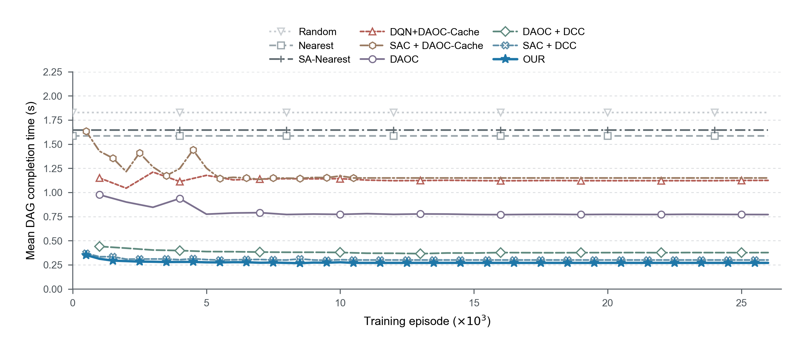

# 固定场景验证曲线：v3 排版预览

日期：2026-09-08。

本版将图例中的 `DQN-NoDSA` 改为 `DQN+DAOC-Cache`，并使 OUR 和 SAC + DCC 的水平参考延长段沿用前段的颜色、线型和重复标记。实验原始数值没有修改。

**本图包含非实测的水平参考延长段，只作为排版预览发布，不替换仓库中的正式在线训练曲线。** 延长段上的重复标记用于识别方法，不表示新增验证 checkpoint。图内未单独标注，因此引用图片时必须同时保留下述图注中的说明。

[SVG 矢量图](validation_constant_tail_preview.svg) · [PDF 矢量图](validation_constant_tail_preview.pdf) · [PNG 预览图](validation_constant_tail_preview.png)

## 建议图题与图注

**图题：** 不同方法的训练验证性能比较。

**图注：** 学习曲线表示10个独立训练 seed 在各自固定50个验证场景上的平均 DAG 完成时间，仅汇总所有 seed 均有记录的轮次。OUR、SAC + DCC 及 SAC + DAOC-Cache 在10,500轮之后按末次公共验证均值水平延长，仅作视觉参考，不代表后续实测。启发式方法的水平线表示其每 seed 100个最终评估场景的平均结果。

## 建议正文说明

图X展示了不同方法在训练过程中的验证性能。各学习方法在早期存在不同程度的波动，随后在已记录区间内逐渐趋于稳定。采用 DCC 的三种方法整体获得了较低的 DAG 完成时间，其中 OUR 在末次公共验证点的平均完成时间为0.2703 s，低于 SAC + DCC 的0.3002 s。DAOC + DCC 的验证结果也优于 DAOC，说明协调缓存能够改善当前异构容量环境下的调度性能。

各学习方法在末次公共验证点的性能排序与主结果柱状图一致。两图分别使用验证场景和最终评估场景，因此其具体数值存在差异；最终性能比较及显著性结论以柱状图对应的100场景评估结果为准。

## 与主结果柱状图的关系

| 方法 | 曲线末次公共实测均值（s） | 主结果柱状图均值（s） | 曲线末次公共实测轮次 |
|---|---:|---:|---:|
| DQN+DAOC-Cache | 1.1245 | 1.1308 | 26,000 |
| SAC + DAOC-Cache | 1.1505 | 1.1357 | 10,500 |
| DAOC | 0.7709 | 0.7736 | 26,000 |
| DAOC + DCC | 0.3769 | 0.3773 | 26,000 |
| SAC + DCC | 0.3002 | 0.3001 | 10,500 |
| OUR | 0.2703 | 0.2668 | 10,500 |

- 学习曲线与柱状图取自同一批主实验训练运行，训练 seed 均为51至60。
- 验证记录使用50个固定场景，场景 seed 偏移为500003；柱状图使用另外100个场景，场景 seed 偏移为1000003。两者采用冻结模型、关闭探索的策略评估方式，但不属于同一场景集合。
- 每种方法分别取10个 seed 共有的验证轮次进行算术平均。部分 seed 仍有更晚的真实验证记录，这些记录保留在源数据 CSV 中，没有混入只有部分 seed 的均值。
- OUR 和两种 SAC 的10-seed公共曲线都截止于10,500轮；之后的水平段不是各 seed 最终 checkpoint 重新评估的结果，也不能用于证明训练到26,000轮的性能。
- 本图未进行平滑或人为下降调整。真实点之间以直线连接；参考延长段严格保持末次公共均值不变。

## 实验设置应披露的事项

当前训练运行采用前5,000轮更新缓存、之后固定缓存并继续训练卸载策略的设置。验证与最终评估阶段均冻结策略和缓存状态。不能将这组运行描述为整个训练过程持续联合更新缓存与卸载策略，也不能将5,000轮固定缓存说成 DAOC 原论文的设置。

## 文件与数据来源

- `validation_constant_tail_preview.svg`、`.pdf`、`.png`：与本机确认的 v3 图片字节一致。
- `recorded_validation_source.csv`：各学习方法、各 seed 的全部已保存验证记录；不包含伪造的后续验证结果。
- `display_coordinates.csv`：作图均值及参考线端点。`constant_reference_not_measured` 明确表示非实测延长点，其样本数为0。
- `manifest.json`：聚合规则、各 seed 的真实终点、原始来源文件 SHA-256、图片 SHA-256 和使用边界。

发布副本中的来源路径已转成相对于原实验项目根目录的标识，不包含本机用户目录。完整训练目录不随本图上传；这些路径用于溯源，不表示仓库内存在对应完整训练文件。数值列与图片内容不因路径整理而改变。

正式图 `paper_assets/formal_figures/fig08_convergence.svg` 仍保留原样，表示实测的在线训练轨迹，与本目录的验证集排版预览不是同一数据口径。
